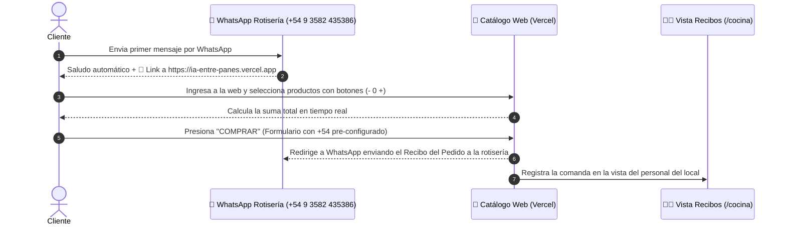

# 🥪 MEMORIA COMPLETA DEL PROYECTO: IA ENTRE PANES

Sistema inteligente de automatización de pedidos por WhatsApp y Catálogo Web interactivo para la rotisería **"Entre Panes"**.

---

## 📌 1. Visión General y Problema a Solucionar

* **Negocio**: Rotisería & Casa de Comidas *"Entre Panes"*.
* **Número de WhatsApp de la Rotisería**: `+54 9 3582 435386` (`54935582435386`).
* **URL en Vivo (Producción Vercel)**: **[https://ia-entre-panes.vercel.app](https://ia-entre-panes.vercel.app)**.
* **Problema Resuelto**: Eliminación de la atención manual por WhatsApp en horas pico. Ahora los clientes reciben una respuesta automática inmediata con el catálogo web, arman su carrito con botones directos `- 0 +` y envían su recibo listo directamente a la rotisería.

---

## 🔄 2. Flujo Completo de la Experiencia (Paso a Paso)



---

## 🛠️ 3. Especificaciones Técnicas e Implementación

### A. Catálogo Web Interactivo (`src/app/page.tsx`)
* **Controles Directos `- 0 +`**: Cada tarjeta de producto permite sumar o restar unidades de manera inmediata.
* **Suma en Tiempo Real**: Barra flotante inferior que calcula la cantidad de ítems e importe total en pesos ARS.
* **Formulario de Compra**:
  * 👤 **Nombre Completo**.
  * 📞 **Celular (WhatsApp)**: Pre-configurado por defecto con `+54 ` para evitar errores de código de país.
  * 📍 **Aclaración del Lugar / Dirección de Envío**.
* **Destino del Recibo**: Al hacer clic en *"Generar y Enviar Recibo a WhatsApp"*, se abre WhatsApp con la comanda dirigida a la rotisería (`+54 9 3582 435386`).

### B. Vista de Recibos para el Personal (`src/app/cocina/page.tsx`)
* Accesible mediante el enlace **`https://ia-entre-panes.vercel.app/cocina`**.
* Muestra los recibos entrantes en tiempo real con datos del cliente, dirección, ítems y botón de **"Despachar Pedido"**.

### C. Agente Bot de WhatsApp (`src/lib/whatsapp/bot.ts`)
* Integración con `@whiskeysockets/baileys` para vincular el número de la rotisería escaneando código QR (`npm run whatsapp`).
* Responde automáticamente a cualquier mensaje inicial con la plantilla de saludo y el enlace oficial a Vercel.

---

## 📝 4. Formato de Mensajes y Recibo

### Saludo Automático por WhatsApp:
```text
Buenas noches! Te estás comunicando con *Entre Panes*. ¿Qué te preparamos hoy? 😎

Somos *ENTRE PANES*! 🥪🍔🍟

Horario de atención: Lunes a Domingos de 19:30hs a 23:30hs!

*Recordá que para ver precios, nuestros productos y realizar tu pedido, ingresá al siguiente link:*

⬇️⬇️⬇️⬇️⬇️⬇️⬇️⬇️⬇️

https://ia-entre-panes.vercel.app

Estamos a tu disposición!

📍*IMPORTANTE*: 

👉🏻 ALIAS: entrepanes.mp
🧒🏻 Titular: ENTRE PANES S.A.S.
📞 Teléfono: +54 9 3582 435386

*LAS PROMOS SON SOLAMENTE EN EFECTIVO*
```

### Recibo Estructurado Generado tras "COMPRAR":
```text
_Entre Panes - Recibo de Pedido_

_Número de pedido:_
1001

_Nombre:_
Juan Pérez

_Celular del cliente:_
+54 9 11 2233 4455

_Dirección / Aclaración del lugar:_
Calle Falsa 123 (esq. San Martín)

_Fecha y Hora:_
21-08-2026 - 21:30

1x _Lomo Entre Panes Especial_
1x _Sándwich de Milanesa Completo_
1x _Papas Fritas Grandes con Cheddar_

_Valor Total:_
$23000.00
```

---

## 🚀 5. Despliegue y Comandos

* **URL Producción en Vercel**: `https://ia-entre-panes.vercel.app`
* **Vista de Recibos Local**: `http://localhost:3000/cocina`
* **Ejecutar servidor local**: `npm run dev`
* **Ejecutar Bot de WhatsApp**: `npm run whatsapp`
* **Desplegar a Vercel**: `npx vercel deploy --yes --prod --token <TOKEN>`
